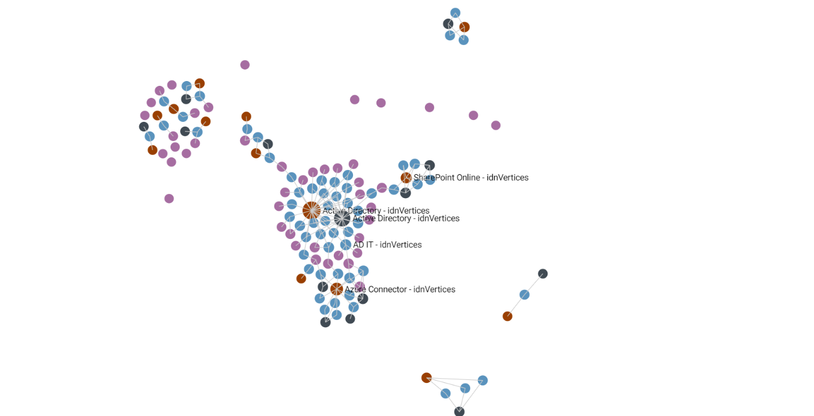

# PowerShell to ArangoDB

This project aims to extract IdentityNow Data with PowerShell module, 
export it in an ArangoDB-compatible format, and visualize the data.

The following example presents:

* Sources as red nodes
* Apps in dark blue
* Access Profiles in light blue
* Roles in purple

We can see "isolated" roles without any access profile.
We can also lots of access profiles linked to Active Directory and roles with 1 access profiles.

## Start

    docker run -p 8529:8529 -e ARANGO_ROOT_PASSWORD=openSesame arangodb/arangodb:3.8.0

## Setup IdentityNow PowerShell Module

    $orgName = "customername-sb"
    Set-IdentityNowOrg -orgName $orgName

    # IdentityNow Admin User
    $adminUSR = "identityNow_admin_User"
    $adminPWD = 'idnAdminUserPassword'
    $adminCreds = [pscredential]::new($adminUSR, ($adminPWD | ConvertTo-SecureString -AsPlainText -Force))

    # IdentityNow Personal Access Token as generated through the IdentityNow Portal and your personal identity profile preferences
    $patClientID = 'yourClientID'
    $patClientSecret = 'yourClientSecret'
    $patCreds = [pscredential]::new("$($patClientID)", ($patClientSecret | ConvertTo-SecureString -AsPlainText -Force))

    Set-IdentityNowCredential -AdminCredential $adminCreds -PersonalAccessToken $patCreds
    Save-IdentityNowConfiguration

## Queries

Relations with/child of a role:

    FOR c IN idnVertices
        FILTER c.name == "Receivable Accountant"
        FOR v IN 2 OUTBOUND c idnEdges
            RETURN DISTINCT v

Relations with/parents of a source:

    FOR c IN idnVertices
        FILTER c.name == "Microsoft 365"
        FOR v IN 2 INBOUND c idnEdges
            FILTER v.`type` != 'application'
            RETURN  v